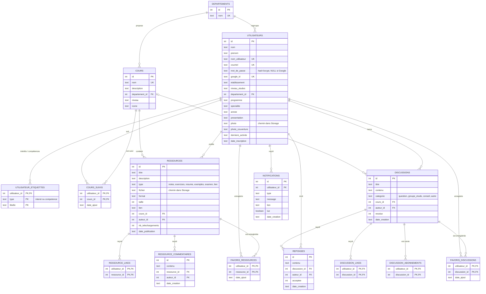

# Schéma de la base de données – StudyMate

Base PostgreSQL hébergée sur **Supabase**, construite à partir de la maquette du projet (12 écrans).
Le script de création est dans [`server/database/schema.sql`](../server/database/schema.sql) (`npm run db:init`).

Types utilisés : les identifiants sont des `BIGINT` générés automatiquement, les dates des `TIMESTAMPTZ`
(date + heure + fuseau) et les oui/non des `BOOLEAN`. Le diagramme simplifie ces types (`int`, `text`).

## Diagramme

## Correspondance avec la maquette

| Écran | Tables utilisées |
|---|---|
| 1. Accueil (non connecté) | aucune (page statique), recherche sur `cours`, `ressources`, `discussions` |
| 2. Inscription | `utilisateurs`, `departements` |
| 3. Connexion | `utilisateurs` (courriel **ou** nom d'utilisateur, ou `google_id`) |
| 4. Tableau de bord | compteurs sur `cours_suivis`, `ressources`, `discussions`, `favoris_*` ; ressources et discussions récentes |
| 5. Liste des cours | `cours`, `departements` (+ nombre de ressources et de discussions par cours) |
| 6. Ressources d'un cours | `ressources`, `ressource_likes`, `ressource_commentaires` |
| 7. Entraide | `discussions` (onglets = `categorie`, « Mes cours » = filtre sur `cours_suivis`), `discussion_likes`, `reponses` |
| 8. Détail d'une discussion | `discussions`, `reponses`, `discussion_abonnements` (bouton « Suivre ») |
| 9. Rechercher des étudiants | `utilisateurs` (filtres département, programme, niveau), `utilisateur_etiquettes` |
| 10. Profil étudiant | `utilisateurs`, `utilisateur_etiquettes`, et ses `cours_suivis`, `ressources`, `discussions` |
| 11. Publier une ressource | `ressources`, `cours` |
| 12. Favoris | `favoris_ressources`, `favoris_discussions` |
| Menu : Notifications | `notifications` |

## Choix importants

- **Les compteurs ne sont pas stockés** (« 48 ressources », « 12 réponses », « 32 likes ») : ils sont calculés avec `COUNT(*)`, comme ça ils sont toujours justes. Seul `nb_telechargements` est stocké, car un téléchargement n'est pas une ligne d'une autre table.
- **Connexion Google** : un compte a soit un `mot_de_passe` (haché avec bcrypt), soit un `google_id`, et au moins l'un des deux est obligatoire.
- **« En ligne »** : on met `derniere_activite` à jour à chaque requête et on considère l'utilisateur en ligne si elle date de moins de 5 minutes.
- **Intérêts et compétences** : une seule table `utilisateur_etiquettes` avec une colonne `type`, au lieu de deux tables presque identiques.
- **Favoris** : deux tables séparées (ressources et discussions) pour garder de vraies clés étrangères.
- **Courriel et nom d'utilisateur uniques sans tenir compte des majuscules** : `Kader@uqac.ca` et `kader@uqac.ca` sont le même compte (index uniques sur `lower(...)`).
- **Fichiers** : les PDF et les photos ne sont pas dans la base mais dans **Supabase Storage** (buckets `ressources`, privé, et `photos`, public). La base garde seulement leur chemin.
- **Suppression d'un compte** : tout ce que l'utilisateur a créé est supprimé (`ON DELETE CASCADE`). Un département ne peut pas être supprimé tant qu'il contient des cours (`ON DELETE RESTRICT`).
- **Sécurité Supabase (RLS)** : Supabase rend les tables accessibles depuis Internet avec sa clé publique. Le schéma active la *Row Level Security* sur toutes les tables sans aucune règle, ce qui bloque cet accès : seul notre serveur Express, connecté directement à la base, peut lire et écrire.
- **Sessions** : la table `sessions` garde les connexions des utilisateurs (gérée automatiquement par `connect-pg-simple`).

## Évolutions possibles

- `etablissements` / `programmes` en tables si vous voulez des listes déroulantes contrôlées
- Messagerie privée entre étudiants (`conversations`, `participants`, `messages`)
- `signalements` pour la modération
- `parametres` utilisateur (notifications par courriel, confidentialité du profil)
